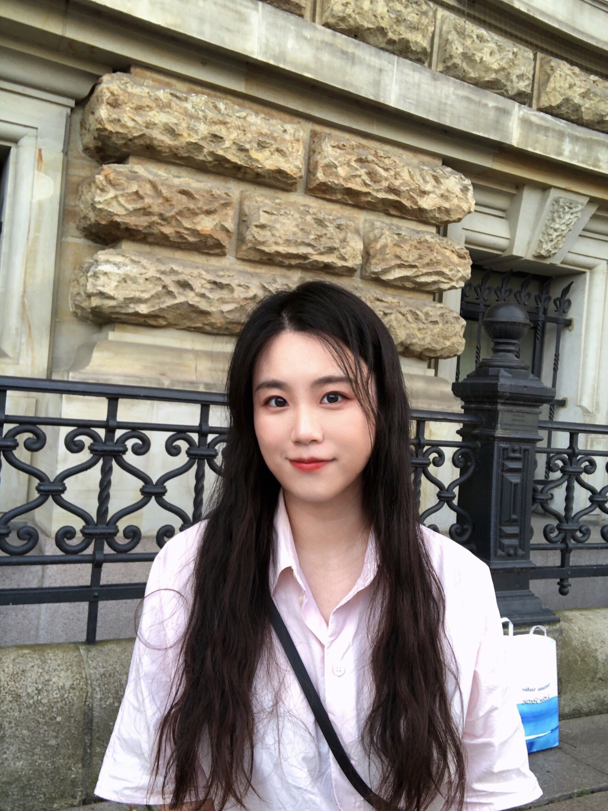

## Hi there 👋

## 🙋‍♀️ about myself 
Hi, I am Yanhua.  I major in **Robotics** in my master's and have graduated from TU Darmstadt in Germany in 2021. I studied ship and ocean engineering at my bachelor's in the Technology University of Wuhan. I have a great interest in Robotics, Reinforcement Learning, and Machine learning.

Here is me in Germany:

And Now I come back 👻!
Me and my friend in Halloween Party 🎃:
